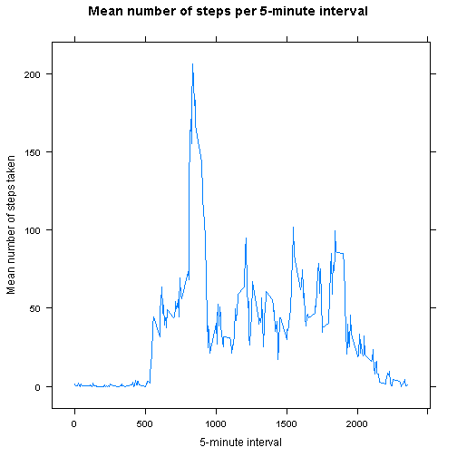
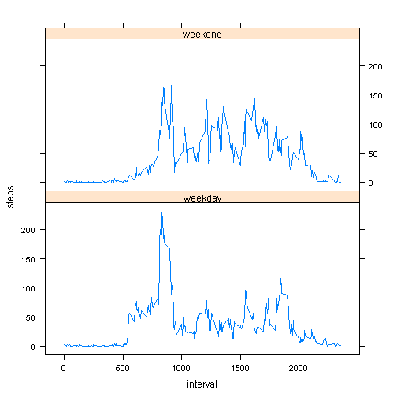

# Reproducible Research: Peer Assessment 1

## Loading and preprocessing the data
'lattice' plotting system is used to enable faceting (used in the last plot in this report):

```r
library(lattice)
```
Load the data:

```r
activityData <- read.csv(unzip("activity.zip"))
```

## What is mean total number of steps taken per day?
Create a histogram of total steps per day in the observed period:

```r
totalStepsPerDate <- aggregate(steps ~ date, data = activityData, FUN = sum)
hist(totalStepsPerDate$steps,
     breaks = 30, 
     xlab = "Total Step Count per day", 
     main = "Histogram: Number of steps per day",
     col = "springgreen3")
```

 

Mean number of daily taken steps:

```r
mean(totalStepsPerDate$steps)
```

```
## [1] 10766
```

Median number of daily taken steps:

```r
median(totalStepsPerDate$steps)
```

```
## [1] 10765
```


## What is the average daily activity pattern?
Create a plot of interval (x axis) versus mean numbers of steps in that intervall over the observed days:

```r
meanStepsPerInterval <- aggregate(steps ~ interval, data = activityData, FUN=mean)
print(xyplot(steps ~ interval,
             data = meanStepsPerInterval,
             type = "l",
             xlab = "5-minute interval", 
             ylab = "Mean number of steps taken",
             main = "Mean number of steps per 5-minute interval"))
```

 

Interval with most steps:

```r
meanStepsPerInterval[meanStepsPerInterval$steps == max(meanStepsPerInterval$steps), 1]
```

```
## [1] 835
```

## Imputing missing values
Number of missing values:

```r
sum(!complete.cases(activityData))
```

```
## [1] 2304
```

Fill missing observations of steps with the mean number of steps in that interval:

```r
imputedData <- merge(activityData,
                     meanStepsPerInterval,
                     by="interval",
                     all=TRUE,
                     suffixes=c("", ".mean"))
imputedData[is.na(imputedData$steps), "steps"] <- imputedData[is.na(imputedData$steps), "steps.mean"] 
imputedData$steps.mean <- NULL
```

Imputed data: Create a histogram of total steps per day in the observed period:

```r
totalStepsPerDateImputed <- aggregate(steps ~ date, data = imputedData, FUN = sum)
hist(totalStepsPerDateImputed$steps,
     breaks = 30, 
     xlab = "Total Step Count per day", 
     main = "Histogram: Number of steps per day",
     col = "springgreen3")
```

 

Mean number of daily taken steps:

```r
mean(totalStepsPerDateImputed$steps)
```

```
## [1] 10766
```

Median number of daily taken steps:

```r
median(totalStepsPerDateImputed$steps)
```

```
## [1] 10766
```

Mean stays unchanged (naturally, because we uses the mean values to fill in missing data).
Median is only very slightly larger now.

## Are there differences in activity patterns between weekdays and weekends?
Make weekdays() function return english names on my German system (or any other non-english locale):

```r
Sys.setlocale("LC_TIME", "C")
```

Create a factor with levels 'weekday' and 'weekend':

```r
isWeekend <- weekdays(as.Date(imputedData$date)) %in% c("Saturday","Sunday")
imputedData$weekend <- as.factor(ifelse(isWeekend, "weekend", "weekday"))
facetedMeanValues <- aggregate(steps ~ interval + weekend, data = imputedData, FUN=mean)
```

Make a panel with plots of mean number of steps in weekdays versus weekends:

```r
print(xyplot(steps ~ interval | weekend, data = facetedMeanValues, type = "l", layout = c(1, 2)))
```

 

There clearly is a difference in activity in between weekdays and workdays.

